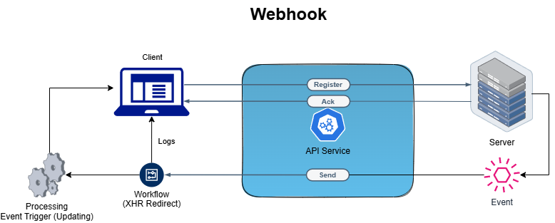

# webhook

- This webhook is inspired by [webhook.site](https://webhook.site/)

### Architecture (Version#1):

 

### Steps (Version#1):
  - Learn webhook working
  - Programming Language - Rust/Python
  - Create a project structure tree
  - Does it require me to buy a domain or can I use github hosting?
  - Learn language specific modules (like requests, etc..)
  - Create a simple dynamic UI using NextJs
  - Test using Postman, cURl/libURL, Innvocations from programming language modules (requests, #include <curlpp/cURLpp.hpp>)

### Focused Areas:
  - **Prerequisite Knowledge:** OSI Layer
  - **Programming Language:** Rust Programming
  - **User Interface:** NextJs Framework

### Tasks:
  - [x] ~Create a Google Spread Sheet to update progress~
  - [ ] Create a Architecture

Google Spread Sheet Link: https://docs.google.com/spreadsheets/d/1cXVVii61oINR_bJaU_N5jjD-_vOmzDxZ0VZ2aSQVjDc/edit?usp=sharing
